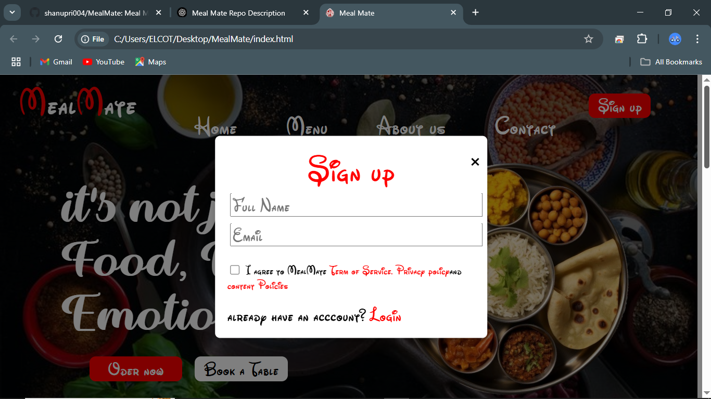
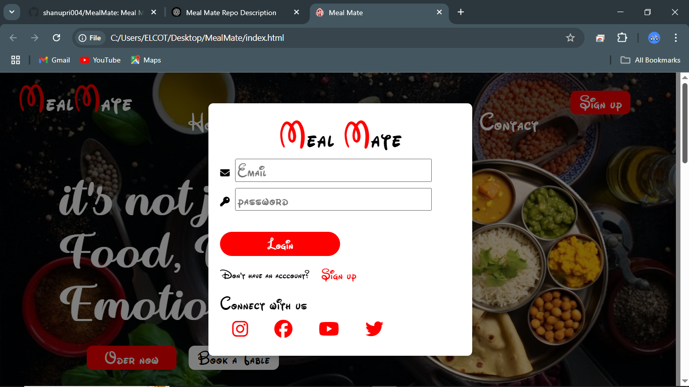
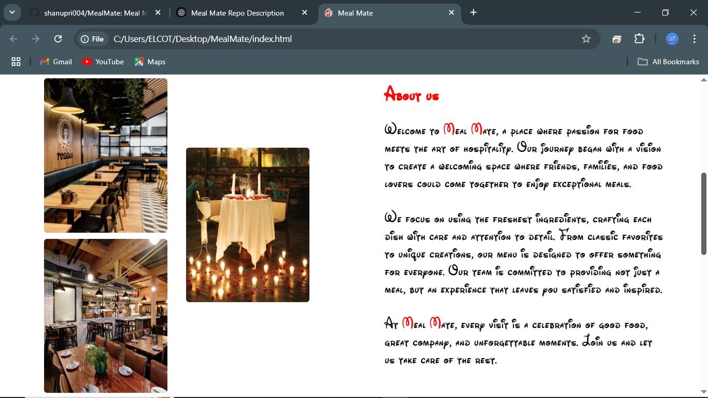
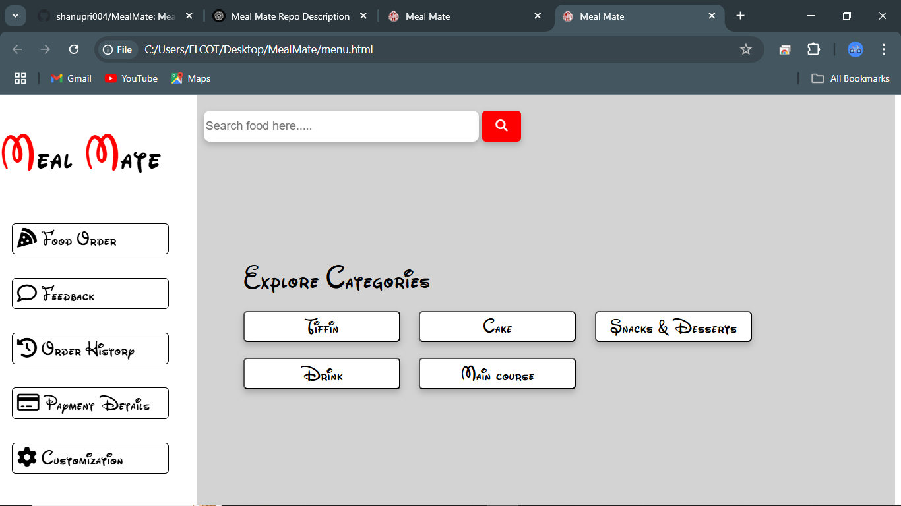

# Meal Mate 🍽️  

Meal Mate is a simple yet visually **attractive static website built with HTML, CSS, and JavaScript**. It features a stylish design but is **non-responsive**. The website includes one more page for Menu categories. 🚀🍽️  

## 🔹 Features  
- Eye-catching design  
- Static website with HTML, CSS, and JS  
- Includes an extra page for additional content  
- Simple and easy to modify  

## 🔹 Technologies Used  
- **HTML** - Structure of the website  
- **CSS** - Styling and layout  
- **JavaScript** - Basic interactivity  

## 🔹 Installation & Usage  
1. Clone the repository:  
   ```bash
   git clone

## 🔹 Screenshots
    ### Homepage  
    
      #### SignUp
      
      #### Login
      
      #### AboutUS
      
      #### Book a Table
      
      #### Promo video
      
      #### ContactUs
      

  ### MenuPage
   

